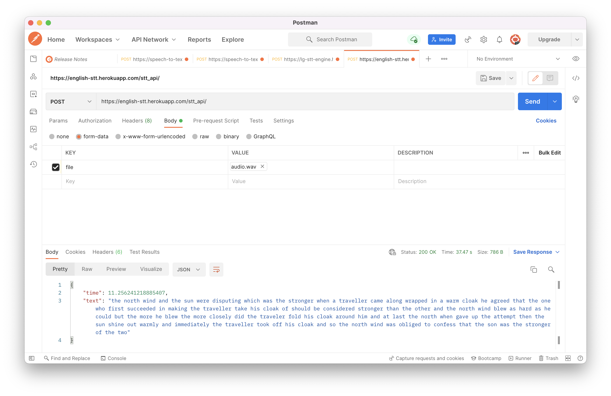

## Deploy Coqui-ai english STT to heroku

I will be showing you how to deploy the coqui-ai english speech to text module on heroku such that you can use it within your applications.

The model we will deploy can be found [here](https://coqui.ai/english/coqui/v1.0.0-large-vocab) . It is a large vocab English speech to text model.

First within your terminal, clone this [repository](https://github.com/KakoozaJerry/en-stt-engine.git) as shown below and navigate into the `en-stt-engine` directory

```bash
git clone https://github.com/KakoozaJerry/en-stt-engine.git
cd en-stt-engine
```

Make sure you have git lfs installed on your machine, you can find instructions [here](https://git-lfs.github.com/).

Run the command below after installing git lfs 
```bash
git lfs install
```

It should return something like what is below
```bash
Updated git hooks.
Git LFS initialized.
```

Open your heroku in the browser and type the link below

[https://dashboard.heroku.com/new-app](https://dashboard.heroku.com/new-app)

Incase you are not logged in you will be prompted to do so.
Your webpage should return the view below, where you can input the name you want for the app, I use `english-stt`


Now you can go back to your terminal and run 
```bash
heroku login
```
You will see the log below 
```bash
heroku: Press any key to open up the browser to login or q to exit: 
```
Press any key as stated and click the login button shown in the browser, if successful this will show.

```bash
Opening browser to https://cli-auth.heroku.com/auth/cli/browser/......
Logging in... done
Logged in as user@gmail.com
```

Set the name of the remote origin from heroku app you created above using the command below

```bash
heroku git:remote -a <stt-app-name>
```
This should return

```bash
set git remote heroku to https://git.heroku.com/<stt-app-name>.git
```
Specify the heroku python as your build pack as shown below in your terminal

```bash
heroku buildpacks:set heroku/python
```
This is what it should return

```bash
Buildpack set. Next release on english-stt will use heroku/python.
Run git push heroku main to create a new release using this buildpack.
```

Add the ffmpeg buildpack since this will also be needed

```bash
heroku buildpacks:add https://github.com/jonathanong/heroku-buildpack-ffmpeg-latest.git
```

Below is what it should return
```bash
Buildpack added. Next release on english-stt will use:
  1. heroku/python
  2. https://github.com/jonathanong/heroku-buildpack-ffmpeg-latest.git
Run git push heroku main to create a new release using these buildpacks.
```
Add git-lfs buildpack using the command below
```bash
heroku buildpacks:add https://github.com/raxod502/heroku-buildpack-git-lfs
```

This is what will be returned
```bash
Buildpack added. Next release on english-stt will use:
  1. heroku/python
  2. https://github.com/jonathanong/heroku-buildpack-ffmpeg-latest.git
  3. https://github.com/raxod502/heroku-buildpack-git-lfs
Run git push heroku main to create a new release using these buildpacks.
```

Set your `HEROKU_BUILDPACK_GIT_LFS_REPO` variable to point to the github repository as shown below

```bash
heroku config:set HEROKU_BUILDPACK_GIT_LFS_REPO=https://github.com/KakoozaJerry/en-stt-engine.git
```

This is what will be returned
```bash
Setting HEROKU_BUILDPACK_GIT_LFS_REPO and restarting ⬢ english-stt... done, v6
 ▸    Warning: The "HEROKU_" namespace is protected and shouldn't be used.
```
You should be able to publish your app using this command

```bash
git push heroku main:master --no-verify
```

This will take a while depending on the speed of your internet

After a successful deployment, you should see successful deployment and you can test out your stt api in postman as shown below




You can test it out with this [audio](https://github.com/KakoozaJerry/en-stt-engine/blob/main/audio.wav) and a key value of `file`.

Make sure to select form data as shown in the screenshot above.


